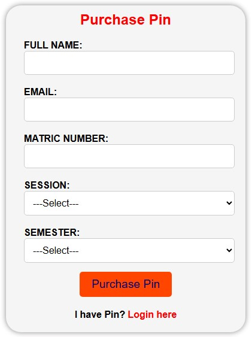
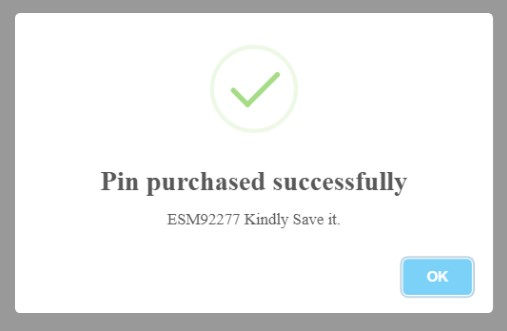
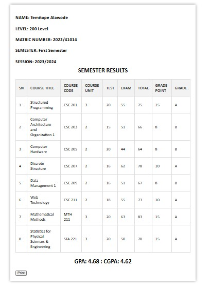

# Result Checker Website

# Project Overview

The Result Checker Website allows students to check their academic results for a specific semester in a session by purchasing a unique pin. The website interacts with a database to verify the pin and retrieve the student's results if available.

# Features


1. **Pin Purchase:** Users can buy a pin to check their results.
2. **Result Retrieval:** After entering the purchased pin, users can view their academic results for a particular semester.
3. **Database Integration:** Results are stored in a database and retrieved securely using the provided pin.
4. **Session and Semester Selection:** Allows users to select the specific session and semester for their results.

# Technologies Used


1. **HTML5** for structure
2. **CSS3** for styling
3. **PHP** for server-side logic and database handling
4. **MySQL** (via **XAMPP** for the local database)

# Project Structure

- **index.php:** The homepage where users can input necessary information to purchase pin.
- **pin.php:** The page where users will see the purchased pin after successful payment.
- **login.php:** The page where users can enter the purchased pin to check their result.
- **result.php:** The page where the users result will be displayed.
- **ResultChecker.php:** This file contains the necessary php functions and also database connection.
- **Auth.php:** This file contains the codes for authentication like creating database, tables.
- **styles.css:** Contains the styling files for the home page.
- **result.css:** Contains the styling files for the result page.
- **Dockerfile:** This file contains the instructions to create a Docker image for the project

# Screenshots 


1. Homepage
- 

2. Pin page
- 

3. Login Page
- 

4. Result Page
- 

# Setup Instructions


1. Clone the repository to your laptop, system or computer by running this:
```bash
   git clone https://github.com/Temitope1606/ResultChecker.git
  ```
2. Set up the database:
  - Make sure you have XAMPP or WAMP running.
  - Place the cloned repository in the htdocs folder (for XAMPP) or the www folder (for WAMP).
  - Open your browser and run localhost/foldername/Auth.php to create the necessary database and tables.
  - Update the database connection settings (like database name and table name) in the Auth.php file.
3. Access the website
  - Run this on your browser:
  - localhost/foldername/index.php

# Future Improvements

- **Email Notifications:** Automatically send results to students via email after checking.
